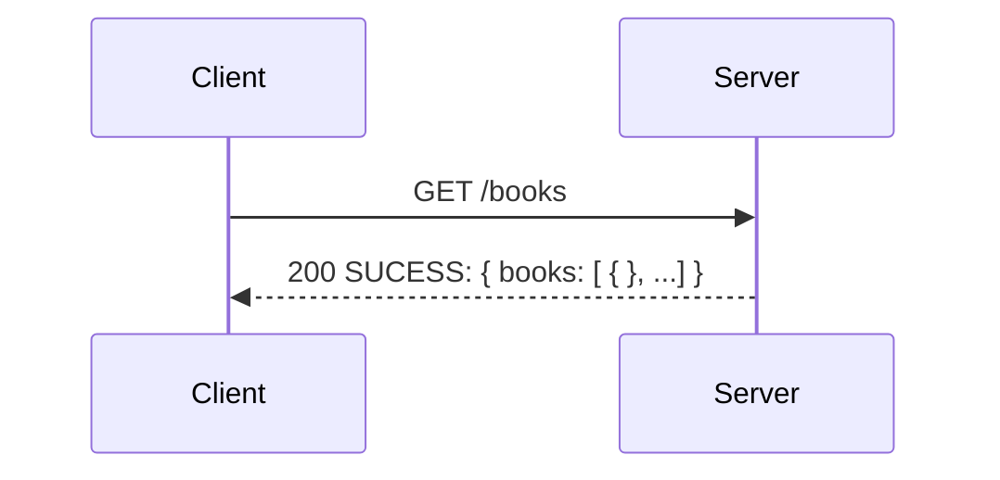
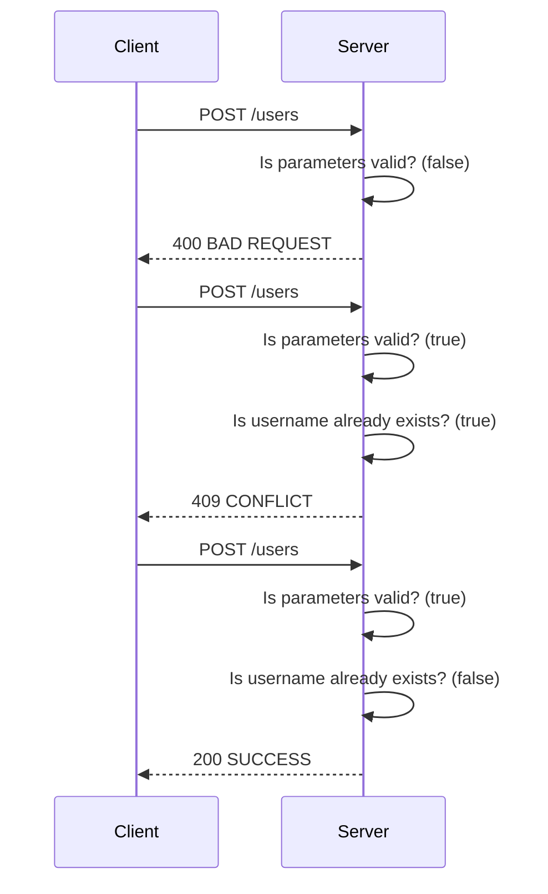
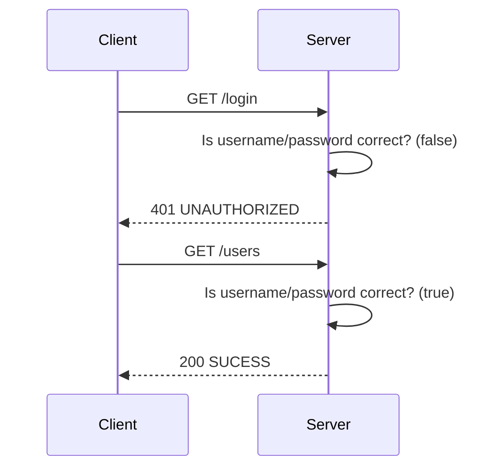
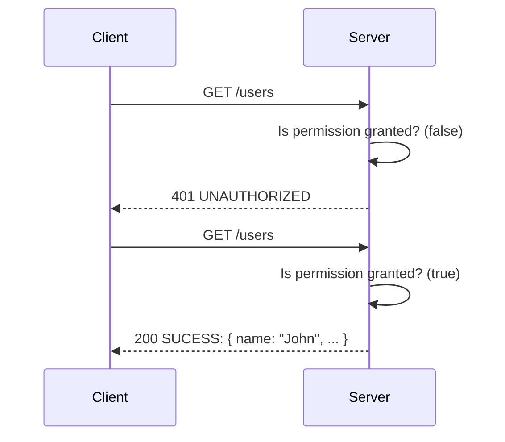
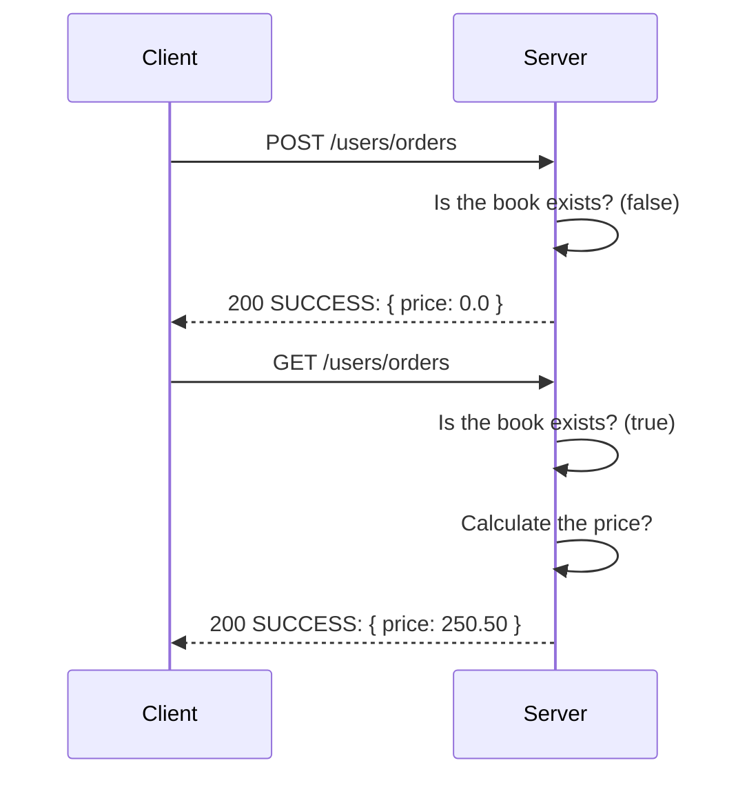
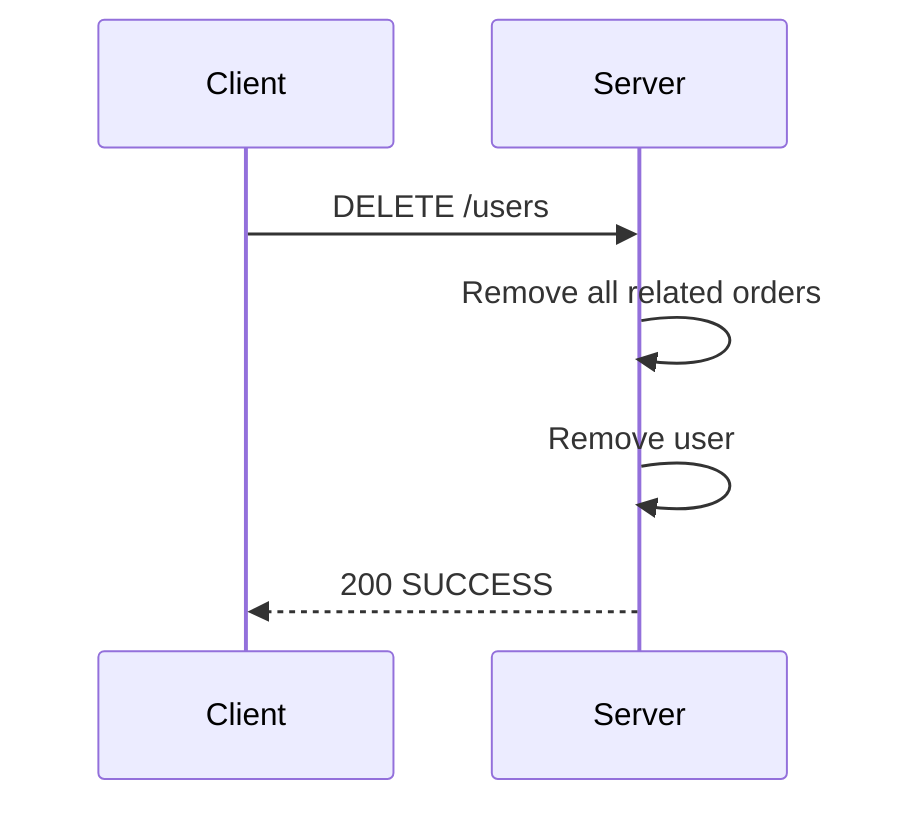

# RESTful API for a bookstore

The API that allows users to login, perform user related tasks, view a list of books and place book orders.

# Database Design

# Sequence Diagram

**GET /books**
Gets a list of books from an external book publisher’s web services and returns the list sorted alphabetically with the recommended books always appears first

**POST /user**
Create a user account and store user’s information in Users table (DB).

**GET /login**
User login authentication API.

**GET /users**
Gets information about the logged in user. A successfully authenticated request returns information related to the user and the books ordered

**POST /users/orders**
Order books and store order information in Orders table (BOOK_ORDER). This returns the total price for a successful order

**DELETE /users**
Delete logged in user’s record and order history.

# API Document

You can find the [API Document](https://raw.githubusercontent.com/juthakiat/temp/master/api-docs.json) here.

